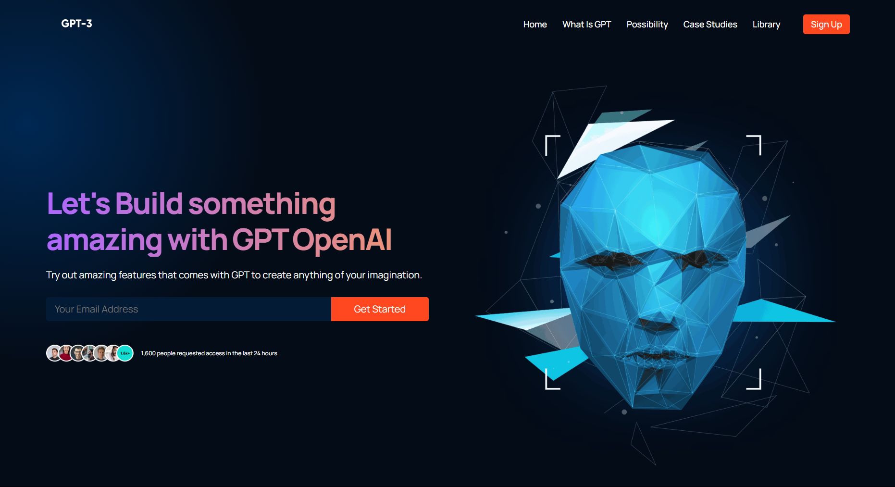

# GPT-3 Landing Page

A modern landing page showcasing GPT-3 capabilities and features, built with React and Vite.



## Features

- Responsive design that works on all device sizes
- Modern UI/UX with gradient effects
- Smooth scrolling navigation
- Interactive components
- Mobile-friendly navigation menu
- Optimized performance

## Tech Stack

- **React** - UI library
- **Vite** - Build tool
- **CSS3** - Styling
- **Lucide React** - Icon library

## Project Structure

```bash
gpt-landing-page/
├── public/              # Static files
├── src/
│   ├── assets/          # Images and other assets
│   ├── components/      # Reusable UI components
│   │   ├── article/     # Blog article component
│   │   ├── brand/       # Brand logos component
│   │   ├── CTA/         # Call to action component
│   │   ├── feature/     # Feature component
│   │   └── navbar/      # Navigation component
│   ├── containers/      # Page sections
│   │   ├── blog/        # Blog section
│   │   ├── features/    # Features section
│   │   ├── footer/      # Footer section
│   │   ├── header/      # Header section
│   │   ├── possibility/ # Possibility section
│   │   └── what-gpt/    # What is GPT section
│   ├── App.jsx          # Main app component
│   ├── App.css          # Global styles
│   ├── index.css        # CSS variables and fonts
│   └── main.jsx         # App entry point
├── index.html           # HTML template
├── vite.config.js       # Vite configuration
└── package.json         # Project metadata and dependencies
```

## Getting Started

### Prerequisites

- Node.js (v16 or later)
- npm or yarn

### Installation

1. Clone the repository

   ```bash
   git clone https://github.com/yourusername/modern-landing-page-gpt.git
   cd modern-landing-page-gpt
   ```

2. Install dependencies

   ```bash
   npm install
   # or
   yarn
   ```

3. Start the development server

   ```bash
   npm run dev
   # or
   yarn dev
   ```

4. Open your browser and visit <http://localhost:5173>

## Building for Production

To create a production build:

```bash
npm run build
# or
yarn build
```

This will generate optimized files in the `dist` directory.

## Deployment

The project is configured for GitHub Pages deployment:

```bash
npm run deploy
# or
yarn deploy
```

This will build the project and deploy it to GitHub Pages.

## Key Components

- **Navbar**: Navigation menu with mobile responsiveness
- **Header**: Hero section with call-to-action
- **Brand**: Company logos showcase
- **WhatGPT**: Information about GPT-3 technology
- **Features**: Key features and capabilities
- **Possibility**: Future possibilities section
- **CTA**: Call-to-action registration banner
- **Blog**: Latest articles and news
- **Footer**: Site information and links

## Customization

- Update colors and gradients in `src/index.css`
- Replace images in `src/assets` folder
- Modify content in component files
- Adjust responsive breakpoints in CSS files

## License

This project is licensed under the MIT License - see the [LICENSE](LICENSE) file for details.

## Acknowledgments

- Project inspired by [Adrian Hajdin's GPT-3 UI/UX project](https://github.com/adrianhajdin/project_modern_ui_ux_gpt3)
- Design inspiration from modern tech websites
- Font from Google Fonts (Manrope)

## Contact

For questions or feedback, please reach out to [your-email@example.com](mailto:rusithhansana.dev@gmail.com)
